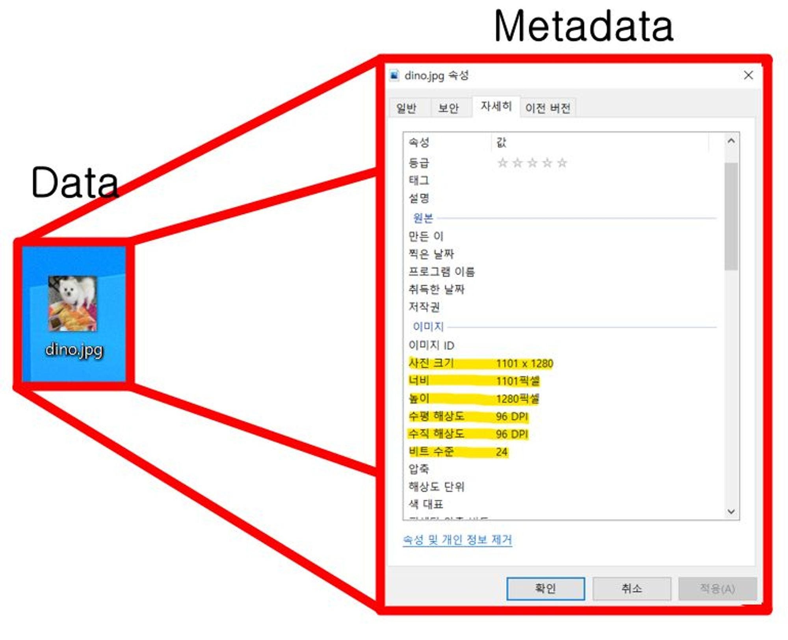

### 파일시스템과 데이터베이스의 차이점에 대해서 설명해주세요.
    

<b>File</b>

 
하드 드라이브, SSD, USB 플레시 드라이브와 같은 저장매체에 대하여 추상화된 정보단위(레코드, 블록 단위)
    
MetaData : 데이터 영역에 기록된 파일의 이름, 위치, 크기, 시간정보, 삭제유무 등의 파일 정보

출처 : https://bakcoding.github.io/assets/images/posting/20220219/data-metadata.jpg
    
데이터 영역 : 파일의 데이터

<b>견본</b>

 

<b>파일 시스템</b>

 
운영 체제에서 하드 드라이브, SSD, USB 플레시 드라이브와 같은 저장장치의 파일을 구성하고 관리하는데 사용

커널 영역에서 동작, 디스크 파티션 별 하나씩 둘 수 있음, 파일 관리 CRUD

목적 : 하드디스크와 메인 메모리 사이의 속도를 줄이기 위함

- FAT(파일 할당 테이블) FAT16, FAT32(이동식 저장 장치로 쓰임)
    
    장점 : 단순성(구현과 사용이 간편), 데이터 복구(구조가 단순해 손상, 삭제도 쉽게 복구), 호환성(제 3자 소프트웨어가 설치되지 않아도 운영 체제에서 기본적 읽고 쓰기 가능)
    
    단점 : 단편화(파일 데이터 디스크 여러 부분 흩어짐으로 성능 저하), 고급 기능 부족(파일 수준 보안 권한, 저널링, 암호화, 압축 지원 안함), 볼륨 이름 제한(이름 11자 초과 불가), 파일 이름 제한(8.3자)
    
- exFAT(확장 파일 할당 테이블, 외부 SSD같은 이동식 저장 장치에 사용)
    
    장점 : 대용량 파일과 파티션 크기 지원(4GB이상), 효율적인 디스크 공간 활용(더 작은 클러스터 크기 사용), 호환성(설치되지 않아도 읽고 쓰기 가능)
    
    단점 : 제한된 메타데이터 지원(파일 수준 보안 권한, 저널링, 암호화 지원 안함), 단편화(FAT와 같다)
    
- NTFS(신기술 파일 시스템, 고급 제공 하지만 Windows이외 호환성 제한)
    
    장점 : 보안 및 권한(보안 모델 제공, 개별 파일 폴더에 권한 설정 그룹 액세스 권한 제어가능), SSD에 대한 TRIM지원(TRIM 사용하지 않는 데이터 드라이브 알려줘 SSD가 쓸 공간 지우고 준비, NTFS 선택시 기본적 TRIM 활성화)
    
    단점 : 디스크 오류 및 복구(여전히 디스크 오류 발생), 단편화(특히 CRUD때 NTFS파일 시스템 단편화 할 수 있음)
    
- APFS(Apple 파일 시스템)
    
    장점 : 향상된 성능, 데이터 보안
    
    단점 : SSD에 대한 TRIM 지원(다른 파일 시스템에 비해서는 비효율적, TRIM은 데이터블록 관리통해 SSD성능 수명 최적화), 제 3자 소프트웨어 지원(오래된 드라이브는 APFS 지원 안하거나 제한있을 수 있음), 설치되지 않은 Window PC에선 읽고 쓰기 불가
    
- HFS(Apple에서 처음 사용한 파일 시스템), HFS + (계층적 파일 시스템)
    
    장점 : 구조 간단, 직관적여 이해 쉬움, 메타데이터 지원
    
    단점 : 고급 기능 부족, 제한된 파일 및 파티션 크기 지원(최대 2GB, 최대 2TB파티션 크게 지원), 파일 시스템 외부에서 파일 손상(특히 파일 확장명 없는 파일, .zip .sit 아카이브 하지 않으면 읽을 수 없음)
    
- Ext4(4차 확장 파일 시스템, Linux 파일 시스템)
    
    장점 : 저널링(변경 사항 디스크 커밋전 추적해서 시스템 충돌, 정전때 더 빠르게 복구 가능, 손상 위험 줄임, 일관성 유지), 파일 및 파티션 크기 증가
    
    단점 : 단편화, 제한된 확장성

    
    

    

    Partition(파티션)

    연속된 저장공간을 하나 이상의 연속되고 독립적인 영역으로 나누어 사용, 하나의 물리적 디스크 안에 여러 파티션을 둠(하나의 파티션으로 구성하기도 함)

<b>차이점</b>

 

1. Data dependency(데이터 종속성)
    
    데이터의 수정이 있을때 File system은 프로그램 자체를 수정하지만, DB는 DBMS를 이용해서 변경이 쉽다
    
2. Data redundancy and inconsistency(데이터 중복성 & 비 일관성)
    
    File system의 경우 독립된 파일을 가져 데이터 중복 저장이 불가피 → 데이터 값 불 일치 발생한다
    
    DB는 조직적 통합해 구조화한다
    
3. Difficulty in accessing data(데이터 접근이 어려움)
    
    File system은 각 작업마다 새로운 프로그램 필요해 데이터 효율적 검색 어려움, DB는 DBMS통해 데이터 공유해 효율성 높아짐
    
4. Integrity problems(무결성 제약조건)
    
    File system 특성상 많은 file을 복제해 새로운 제약조건 발생시 모든 파일 제약조건 추가 어려움
    
    DBMS는 저장될 데이터에 대한 데이터의 타입, 길이, 값 범위 등을 가지고 있다
    
5. Atomicity of updates(원자성 문제)
    
    File system은 부분적 update로 일관성 유지 못한 상태로 남을 수 있음
    ex) 계좌이체 하는데 입금과 출금이 동시에 안될시 큰 문제가 생김 → 원자성 보장 어려움
    DB는 시스템 통합해 관리 쉬움
    
6. Concurrent access by multiple users(여러 사용자의 동시 접근)
    
    File system은 여러 유저가 파일에 동시 접근, 수정되어서 서로 알고 있는 정보 다를 수 있음
    
    DB는 여러 사용자의 요구 동시적 처리 가능함
    
7. Security problems(보안 문제)
    
    File system은 일부 유저에게만 접근 허용 권한 어렵다, DB는 미리 접근 권한을 지정해 줄 수 있다

        
    
- 데이터베이스의 특징에 대해 설명해주세요.
    
    필요한 정보의 연관된 데이터를 모아 구조적으로 통합해 놓은 것
    
    실시간 접근성, 계속적인 변화, 동시 공용, 내용에 의한 참조
    
    자료의 독립성, 데이터 무결성 보장, 개별 생산성 보장
    
- DBMS는 뭘까요? 특징에 대해 설명해주세요.
    
    Database Management System이라고 여러 명의 사용자가 동시에 접근 가능하다
    
    데이터베이스 사용을 위해 DBMS를 설치하는데 MySQL, 오라클, SQL서버, MariaDB등이 있다
    
    DBMS유형에는 계층형, 망형, 관계형, 객체지향형, 객체관계형 5가지가 있습니다. 현제 관계형 DBMS가 가장 많으며 MySQL도 관계형 DBMS에 포함된다
    
    1. 계층형 DBMS
    
    !https://hongong.hanbit.co.kr/wp-content/uploads/2021/11/계층형DBMS.png
    
    각 계층은 트리 형태로, 처음 구성을 완료 후 변경하기가 까다롭다. 또한 다른 구성원 찾는 것이 비효율적이다(지금은 사용하지 않는 형태)
    
    1. 망형 DNS
    
    !https://hongong.hanbit.co.kr/wp-content/uploads/2021/11/망형DBMS.png
    
    하위 구성원끼리도 연결되어 있다. 활용을 위해서는 프로그래머가 모든 구조를 이해하고 있어야 프로그램 작성이 가능했다
    
    1. 관계형 DBMS
    
    !https://hongong.hanbit.co.kr/wp-content/uploads/2021/11/sql_table.png
    
    RDBMS로 불리며 MySQL뿐 아니라 테이블이란 최소 단위로 구성되어 있습니다.
    
    SQL는 표준 SQL을 준수하며 각 제품의 특성을 어느정도 반영하여 사용한다(표준 SQL을 익힌다면 어디서든 사용할 수 있다)
    
    !https://hongong.hanbit.co.kr/wp-content/uploads/2021/11/DBMS-제품.png
    
- 스키마가 뭘까요? 3단계 데이터베이스 구조에 대해 설명해주세요.
    
    스키마는 데이터베이스의 구조와 제약조건에 관해 전반적인 명세를 기술한 것(DB의 데이터가 어떤 구조로 저장 되는가)
    
    개체의 특성 나타내는 - 속성
    
    속성들의 집합으로 이루어진 - 개체
    
    개체 사이에 존재하는 - 관계
    
    **@특징**
    
    스키마는 데이터 사전에 저장됨
    
    > 데이터 사전 : 시스템 전체에 나타나는 데이터 항목들에 대한 정보를 저정한 중앙 저장소(식별자, 엔티티 구성요소, 항목 저장 위치, 항목 참조 위치)
    > 
    
    특정 데이터 모델 통해 만들어지며 현실 세계 특정 부분 표현
    
    시간에 따른 불변 특성 가짐(시불변성)
    
    데이터 구조석 특성 의미
    
    인스턴스에 의해 규정
    
    
    
    관점에 따른 외부, 개념 내부 스키마 구분
    
    1) 개념 스키마 - 전체적인 뷰
    
    : 조직체 전체를 관장하는 입장에서의 DB 정의(모든 응용시스템 필요로 하는 개체 관계, 제약조거들을 포함하게 된다, +효율적 관리를 위한 접근권한, 보안정책, 무결설 규칙등 관한 사항도 추가 포함된다)
    
    2) 내부 스키마 - 데이터 베이스의 물리적 저장구조 정의
    
    : 디스크에 어떤 구조로 저장할 것인가, 데이터 실제 저장방법 기술, 물리적 저장장치와 밀접한 계층, 시스템 설계자 관점의 스키마
    
    3) 외부 스키마 = 서브 스키마 - 사용자 뷰
    
    : 개인의 입장에서 필요한 DB 논리적 구조 정의, 실제 존재 데이터를 어떻게 사용자에게 보여줄건가
    
- 데이터 독립성에 대해서 설명해주세요.
    
    데이터 독립성이란 DB의 구조와 데이터의 내용이 서로 영향을 미치지 않는다
    
    독립성에도 ‘논리적 데이터 독립성’ 과 ‘물리적 데이터 독립성’ 으로 나눌 수 있다
    
    **논리적 데이터 독립성**
    
    DB 논리적 구조가 변경되어도 응용 프로그램이나 사용자의 요구에 영향을 주지 않는다
    
    **물리적 데이터 독립성**
    
    DB 물리적 구조가 변경되어도 데이터에 영향을 주지 않는다. 
    ex) 파일 저장방식, 인덱스 구성이 바뀌어도 스키마나 데이터는 유지된다
    
    ⇒ 데이터 독립성을 통해 DB의 유지보수와 확장성을 향상시키는 장점이 있다, 구조가 변경되어도 사용자에게 영향을 주지 않아 안정성과 신뢰성 높일 수 있다. 보안도 개선할때 쉽게 조치 할수 있다
    
- RDBMS(관계형 데이터베이스 관리시스템)는 뭘까요?
    
    관계형 모델(표 형식)을 기반으로 하는 DBMS의 한 유형
    
    - 테이블이 서로 연관되어 있어 기존 DBMS보다 효율적 데이터 저장, 구성, 관리를 할 수 있다
    - 정규화 통해 데이터 중복성을 최소화하며 트랜잭션을 수행하는 것이 더 쉽다
    - 데이터의 원자성, 일관성, 격리 및 내구성을 유지하며 데이터 무결성을 높인다
    - MSSQL, MySQL, Oracle이 RDBMS 등이 있다
    
     
    
- 릴레이션 스키마와 릴레이션 인스턴스에 대해서 설명해주세요.
    
    **릴레이션**
    
    행과 열로 구성된 테이블
    
    스키마와 인스턴스로 이루어 졌으며. 스키마는 관계 DB의 구성이 어떻게 되었는지 어떤것을 담고있는지 기본적 구조를 정의한다
    
    - 릴레이션 스키마
        
        어떤 정보 담길지 정의
        
    - 릴레이션 인스턴스
        
        릴레이션 스키마에 실제 저장된 데이터 집합
        
    
- 릴레이션의 차수와 카니덜리티에 대해 설명해주세요.
    
    투플 : 릴레이션에서의 행
    
    카디날리티 : 투플의 수
    
    투플(행)이 가지는 속성의 개수는 스키마의 차수와 동일
    
    릴레이션 내의 모든 투플은 서로 중복되지 않아야 한다
    
    **특징**
    
    속성은 단일 값을 가진다
    
    서로 다른 이름을 가진다
    
    한 속성의 값은 모두 같은 도메인 값을 가진다
    
    속성의 순서는 상관없다
    
    릴레이션 내 중복 투플은 허용 안한다
    
    투플의 순서는 상관없다
    
    https://img1.daumcdn.net/thumb/R1280x0/?scode=mtistory2&fname=https://t1.daumcdn.net/cfile/tistory/99BA68435B3569732C
    
- 키(Key)에 대해서 설명해주세요. (슈퍼키, 후보키, 기본키, 대리키, 외래키)
    
    다른 튜플들과 구별할 수 있는 유일한 기준이 되는 속성
    
    > 튜플 : 릴레이션을 구성하는 각각의 행, 속성의 모임
    > 
    
    종류
    
    - 후보키
        
        튜플을 유일하게 식별할 수 있는 속성들의 부분집합
        
        모든 릴레이션은 하나 이상의 후보키를 가져야 함
        
        릴레이션에 있는 모든 튜플에 대해 유일성과 최소성을 만족시켜야 함
        
        ex) <학생> 릴레이션의 ‘학번’ , ‘주민번호’, (휴대폰 번호도 가능하지 않을까?)
        
    - 기본키
        
        특정 튜플을 유일하게 구별할 수 있는 속성
        
        NULL 값을 가질 수 없음(개체 무결성의 첫번째 조건)
        
        기본키로 정의된 속성에는 동일한 값이 중복되어 저장될 수 없습니다(개체 무결성 두번째 조건)
        
    - 대체키
        
        후보키가 둘 이상일 때 기본키를 제외한 나머지 후보키
        
        ex) <학번> 이 기본키 일때 ‘주민번호는 대채키’
        
    - 슈퍼키
        
        한 릴레이션 내에 있는 속성들의 집합으로 구성된 키(모든 튜플중 슈퍼키로 구성된 속성의 집합과 동일한 값은 나타나지 않음)
        
        릴레이션 구성 모든 튜플중 유일성은 만족하지만, 최소성은 만족시키지 못함
        
        ex) ‘학번’ , ‘주민번호’ , ‘학번’ + ‘주민번호’, ‘학번’ + ‘주민번호’ + ‘성명’ 등으로 구성
        
        이때 ‘성명’ 하나만으로 슈퍼키 사용할시 구별이 되지 못해 최소성 만족 못함, 뭉치면 유일성 생기지만 흩어지면 최소성 만족 못한다
        
    - 외래키
        
        관계 맺는 릴레이션 R1, R2 중 릴레이션 R1이 참조하는 릴레이션 R2의 기본키와 같은 R1 릴레이션의 속성
        
        참조되는 릴레이션 기본키와 대응되어 릴레이션 간에 참조 관계를 표현하는데 중요 도구
        
        외래키로 지정될 시 참조 테이블의 기본키에 없는 값은 입력할 수 없음(참조 무결성 조건)
        
        ex) ‘학생’ 릴레이션 참조시 ‘학번’ 은 기본키, ‘학번’ 은 외래키
        
    
- 무결성 제약조건에 대해서 설명해주세요. (도메인 무결성, 개체 무결성, 참조 무결성)
    
    > 무결성 : 데이터의 정확성, 일관성 나타냄
    무결성 제약 조건 : 데이터 베이스의 정확성, 일관성 보장을 위한 저장, 삭제, 수정을 제약하기 위한 조건
    > 
    
    1. 개체 무결성
        
        각 릴레이션의 기본키 구성 속성은 NULL값이나 중복된 값을 가질 수 없다
        
        (ex) 학생 릴레이션에서 ‘학번’이 기본키면 ‘학번’ 은 NULL이 되어선 안됨
        
    2. 참조 무결성
        
        외래키 값은 NULL이거나 참조하는 릴레이션의 기본키 값과 동일해야 한다
        
        각 릴레이션은 참조할 수 없는 외래키 값을 가질수는 없음
        
        (ex) ‘수강’ 릴레이션의 ‘학번’ 속성에는 ‘학생’ 릴레이션의 ‘학번’ 속성에 없는값  입력 못한다
        
    3. 도메인 무결성
        
        릴레이션의 각 튜플이 가지는 속성 값은 서로 달라야 함
        
        (ex) ‘학생’ 에서 ‘이름’, ‘나이’ 는 같을수 있어도 ‘학번’ 은 달라야 한다
        
    4. 고유 무결성
        
        릴레이션 각 튜플이 가지는 속성 값은 서로 달라야 함
        
    5. NULL 무결성
        
        NULL 이 될 수 없다
        
    6. 키 무결성
        
        한개 이상의 키 존재해야 함
        
    
- 사용했던 데이터베이스에 대해서 설명해주세요. (오라클DB, MySQL, MariaDB, MongoDB 등)
    
    
    - MySQL 엔진에 대해서 설명해주세요.
        
        MySQL 서버는 MySQL 엔진과 스토리지 엔진으로 나누어진다
        
        MySQL 엔진은 클라이언트로 부터 오는 요청 처리(요청된  SQL문장을 분석, 최적화) 담당,
        
        스토리지 엔진은 실제 데이터를 디스크 스토리지에 저장하거나 조회하는 부분을 담당
        
        - MySQL 엔진
            
            Connection Handler : 커넥션 및 쿼리 요청 처리 담당
            
            SQL 인터페이스 : DML, DDL, Procedure, View 등 SQL 인터페이스 제공 담당
            
            SQL 파서(parser) : SQL 문법 오류 탐지 및 SQL 쿼리 문장을 MySQL이 처리하기 좋은 토큰 단위로 나눠서 트리 형태로 파싱
            
            SQL 옵티마이저(optimizer) : 쿼리의 최적화된 실행 담당
            
            캐시와 버퍼 : 성능 향상을 위한 보조 저장소 기능 담당
            
        - 스토리지 엔진
            
            MySQL 서버의 가장 밑단에서 실제 디스크에 접근해 데이터 읽고, 디스크에 데이터 쓰는, 실질적 디스크 Read/Write 작업 수행
            
            =(있어보이게 말하기) MySQL 엔진과 플러그인 형태로 연동/분리 가능하고 핸들러 API(핸들러 요청)를 통해 스토리지 엔진에 읽기/쓰기 요청 가능
            
            MySQL 쿼리 전체 실행 구조
            
            https://img1.daumcdn.net/thumb/R1280x0/?scode=mtistory2&fname=https://blog.kakaocdn.net/dn/dI0JKW/btstRranGRL/8adlCecmZo1xNbiJIuP5K0/img.png
            
    
    - (MySQL을 사용했다면) InnoDB에 대해 설명해주세요.
        
        MySQL의 데이터베이스 엔진으로 모든 binary에 내장되어 있음
        
        트랜잭션을 지원하기에, 세이프 스토리지 엔진임
        
        장점
        
        1. 우수한 성능
            
            다수의 사용자 동시 접속, 대용량 데이터 처리
            
            데이터 테이블과 인텍스 테이블 스페이스에 저장하고 있으며, 
            
            테이블 스페이스는 파일과 / 파티션으로 구성
            
        2. 장애 복구 가능
            
            단순히 장애 복구가 아닌, 논리적 장애 복구 수행
            
        3. 데이터 무결성에 대한 보장
            
            InnoDB의 설계에 있어 데이터 무결성에 중점되어 있음
            
        
        단점
        
        1. DeadLock 발생
            
            Node 간 데이터 체크로 인한, DeadLock 발생 가능성 존재
            
        2. 많은 자원 소모
            
            대용량 처리시, 순간적 많은 자원 소모
            
        3. 데이터 복구의 어려움
            
            단순히 파일 백업으로 복구가 아닌, 특정한 방법을 사용해 복구 수행
            
        

---

참조

- https://www.kingston.com/kr/blog/personal-storage/understanding-file-systems 파일 시스템 이해하기
- [https://velog.io/@yuseogi0218/File-System-파일-시스템](https://velog.io/@yuseogi0218/File-System-%ED%8C%8C%EC%9D%BC-%EC%8B%9C%EC%8A%A4%ED%85%9C)
- [https://velog.io/@hsshin0602/CS-지식-데이터베이스-시스템-VS-파일-처리-시스템](https://velog.io/@hsshin0602/CS-%EC%A7%80%EC%8B%9D-%EB%8D%B0%EC%9D%B4%ED%84%B0%EB%B2%A0%EC%9D%B4%EC%8A%A4-%EC%8B%9C%EC%8A%A4%ED%85%9C-VS-%ED%8C%8C%EC%9D%BC-%EC%B2%98%EB%A6%AC-%EC%8B%9C%EC%8A%A4%ED%85%9C)
- [https://hongong.hanbit.co.kr/데이터베이스-이해하기-databasedb-dbms-sql의-개념/](https://hongong.hanbit.co.kr/%EB%8D%B0%EC%9D%B4%ED%84%B0%EB%B2%A0%EC%9D%B4%EC%8A%A4-%EC%9D%B4%ED%95%B4%ED%95%98%EA%B8%B0-databasedb-dbms-sql%EC%9D%98-%EA%B0%9C%EB%85%90/)
- https://jwprogramming.tistory.com/47 스키마
- https://limkydev.tistory.com/108 키
- https://iingang.github.io/posts/DB-Integrity-constraint/ 무결성
- https://jeong-pro.tistory.com/239 MySQL 아키텍쳐(RealMySQL 내용느낌?)
- https://letitkang.tistory.com/155 InnoDB설명