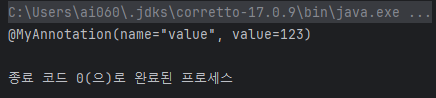

# Annotation(어노테이션)

### 어노테이션이란?

JVM 이 읽는 주석으로서 JDK 5.0부터 사용할 수 있었다, 유용한 정보 제공을 위해 쓰이며 해당 타겟에 대한 동작 수행하는 프로그램 외에는 다른 프로그램에게 영향을 주지 않는다

<br>

### 종류

자바에서 제공하는 표준 어노테이션, 어노테이션 정의에 사용되는 메타 어노테이션, 사용자 어노테이션이 있다

**표준 어노테이션**

자바에서 기본적으로 제공하는 어노테이션이다.

`@Override` : 컴파일러에게 메서드를 오버라이딩하는 것이라 알림

`@Deprecated` : 앞으로 사용하지 않을 대상임을 알린다.

`@FunctionalInterface` : 함수형 인터페이스라는 것을 알린다.

`@SuppressWarning` : 컴파일러가 경고 메시지를 나타내지 않는다.

`@SafeVaragrs` : 제네릭과 같은 가변 인자의 매개변수를 사용할 때의 경고를 나타내지 않는다.

**메타 어노테이션**

어노테이션에 붙이는 어노테이션으로, 어노테이션을 정의하는 데 사용

`@Target` : 어노테이션을 정의할 때 적용 대상을 지정하는 데 사용한다.

`@Documented` : 어노테이션 정보를 javadoc 으로 작성된 문서에 포함시킨다.

`@Inherited` : 어노테이션이 하위 클래스에 상속되도록 한다.

`@Retention` : 어노테이션이 유지되는 기간을 정하기 위해 사용한다.

`@Repeatable` : 어노테이션을 반복해서 적용할 수 있도록 한다.

**사용자 정의 어노테이션**

사용자가 직접 정의하여 사용하는 어노테이션이다.

<br>

어노테이션은 주석과 같은 취급을 받으며 정보가 클래스까지는 남는데, Byte 코드를 로딩했을때 메모리 상에는 남지 않는다.

만약 런타임 까지도 읽어오고(유지하고)싶다면 `@Retention(RetentionPolicy.RUNTIME)` 값을 줘야 한다(기본값 .class)


어노테이션은 원시타입(primitive)과 같은 타입을 가질 수 있음 `String name()`, 또한 기본적인 '값' 들을 가질 수 있다. `String name() default "value"`

만약 상속이 되는 어노테이션(`@Inherited`)을 쓴다면 자식되는 클래스에서도 조회가 된다


<br>

**오버라이드의 내부 구현?**

https://stackoverflow.com/questions/18189980/how-do-annotations-like-override-work-internally-in-java/18202623 


<br>

살펴보기

```java
public static void main(String[] args) {
    Arrays.stream(Book.class.getAnnotations()).forEach(System.out::println);
    // 클래스의 메서드중 getAnnotations() 를 통해 조회 하려 하지만 주석과 같은 취급을 받아 조회 되지 않음
}

@MyAnnotation(123)
static
class Book {
    int value;
    String name;
}
---
@Retention(RetentionPolicy.RUNTIME)
@Target({ElementType.TYPE, ElementType.FIELD})
public @interface MyAnnotation {

//    어노테이션은 원시타입(primitive)과 같은 타입을 가질 수 있음
    String name() default "value";
    int value();
}
```



`@Retention(RetentionPolicy.RUNTIME)` 런타임으로 지정해놔야 사용 가능


어노테이션의 내부 `@RetentionPolicy` 의 타입을 통해 언제 실행되어지는지 보여지는지 알 수 있다 


---

**출처**

- https://www.inflearn.com/course/the-java-code-manipulation/dashboard 백기선님 강의
- https://ittrue.tistory.com/156 