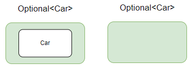

# Optional 과 Null

- Null의 등장
- Optional 소개
- Optional의 활용

---

### Null 의 등장

1965년 알골 프로그래밍 언어를 설계하며 처음 등장했다. null참조는 "값이 없는 상황을 가장 단순하게 나타내는 방법" 으로 생각하고 사용했다 하지만 현재에 와서는 엄청난 비용과 오류를 만들어 내고 있다

컴파일러 자동 확인으로 모든 참조를 안전하게 사용할 수 있을 것이라 생각했지만 어떠한 객체를 사용하려 할때 심심찮게 `NullPointException`을 자주 만나볼수 있다(거의 매일봄ㅠ)

Optional 이전까지 Null예외 줄이는 방법
```java

public String getCarInsuranceNameNullSafeV1(PersonV1 person) {
        if (person != null) {
            CarV1 car = person.getCar();
        if (car != null) {
            Insurance insurance = car.getInsurance();
        if (insurance != null) {
            return insurance.getName();
            }
        }
    }
    return "Unknown";
}

public String getCarInsuranceNameNullSafeV2(PersonV1 person) {
        if (person == null) {
            return "Unknown";
        }
            CarV1 car = person.getCar();
        if (car == null) {
            return "Unknown";
        }
            Insurance insurance = car.getInsurance();
        if (insurance == null) {
            return "Unknown";
        }
    return insurance.getName();
}
```
**문제점**


코드의 들여쓰기 수즌이 증가하거나 null 확인마다 출구가 생기는 문제가 생긴다

null이 왔을때 null은 무형식이어서 모든 참조에 null을 할당할 수 있는데 어떤 의미로 사용했는지 나중에 알수 없다 

null이 왔을때 값이 없어서 null인지 생성한 초기상태여서 null인지 파악할 방법이 없다

자바에서는 모든 포인터를 숨겼지만 null포인터가 있어 예외가 발생한다

> if문을 통해 문제를 해결할 수 있긴 하지만, 이는 문제의 본질을 해결하는 것이 아닌 문제를 뒤로 숨기는 것과 같다

이러한 상황속에서 자바8에서 java.util.Optional<T> 클래스가 나오게 되었다

<br>

### Optional 클래스

    Optional은 선택형 값을 캡슐화 하는 클래스로. Car라는 클래스가 있을때 이 클래스를 감싸서 null인지 값이 있는지를 알 수 있다



값이 없으면 비어있는 것과 같다 -> (Optional.empty() 상태다)

null과 같아 보이지만 차이가 있다면 null은 예외를 발생시키지만 Optional은 .empty() 상태일 뿐이다

=> 위의 코드에서와 같이 현재의 객체가 비어있을수 있을때 Optional로 감싸주면 따로 if문을 사용할 필요없다

- Optinoal 객체 만들기
    - 빈 Optional
    
            Optional<Car> optCar = Optional.emtpy();
    - null이 아닌 값으로 Optional 만들기
    
            Optional<Car> optCar = Optional.of(car);
            여기서 car가 null이면 NullPointerException이 발생한다
    - null값으로 Optional 만들기
  
            Optional<Car> optCar = Optional.ofNullable(car);
            car가 null이면 빈 Optional 객체가 반환된다
    `.of`와 `ofNullable`이 같은 역할을 하는것 같지만 차이가 있다면 of를 사용해 객체를 만든다는 것은 Car는 명시적으로 null아닌 것을 보여준다

아직 끝나지 않은것이 있는데 Optional로 만들었다 해도 `.get()`메서드를 통해 가져올때 비어있으면 또 다시 에러가 뜬다 Optional을 통해서 검사를 하고 꺼내야지만 제대로 Optional을 사용할 수 있다 말할 수 있을 것이다

```java
Optional<Insurance> optInsurance = Optional.ofNullable(insurance);
Optional<String> name = optInsurance.map(Insurance::getName);
```
보통 stream과 함께 사용하게 되는데 flatMap과 Map을 통해서 재구현해 사용한다

- Optional 디폴트 액션
  - get() : 래핑된 값이 있으면 해당 값을 반환하지만 없으면 `NoSuchElementException`을 반환한다. 반드시 Optional이 있을때 사용해야 하는데 null중첩 확인코드와 별반 다를게 없다
  - orElse(T other) : Optional에 값 포함하지 않을때 기본값을 제공한다
  - orElseGet(Supplier<? extends T> other) : 게으른 버전의 orElse로 Optional에 값이 없을때만 실행된다. 디폴트 메서드 만드는데 시간이 걸리기에 사용한다(대체값 비용이 높은 연산일때)
  - orElseThrow(Supplier<? extends X> exceptionSupplier) : Optional이 비었을때 예외의 종류 골라서 발생가능
  - ifPresent(Consumer<? super T> consumer) : 값이 존재할 때 인수로 넘겨준 동작 실행, 값이 없으면 아무일 없다
  - (자바 9에서 추가) ifPresentOrElse(Consumer<? super T> action, Runnable emptyAction) : Optional이 비었을때 실행할 수 있는 Runnable을 인수로 받는다

> Runnable은 자바에서 스레드를 생성하기 위해 사용되는 인터페이스

    @FunctionalInterface
    public interface Runnable {
        void run();
    }
    
    Runnable 인터페이스는 run 메서드 하나만을 가지고 있음
    이 메서드는 매개변수를 받지 않고, 반환값이 없는 메서드

<br>

Optional은 stream과 함께 자주 쓰인다 했었는데 코드를 보면 헷랄리고 어지러운 부분이 많이 보인다. 여기서 주의할 점은 Optional에 stream()메서드가 추가되었는데 8이 아닌 9부터 추가 되었다. 9! 9! 9!

그래서 Java8과 Java9의 Optional 사용하는것을 보면 차이가 조금 있는데 확인해보자

```java
// Java 9 이전
Optional<String> optional = Optional.of("Hello");
Stream<String> stream = optional.map(Stream::of).orElseGet(Stream::empty);
stream.forEach(System.out::println); // "Hello" 출력
// map() 메서드를 사용하여 Optional 객체의 값을 스트림으로 변환하거나, orElse() 메서드를 사용하여 값이 없는 경우에 대체 값으로 스트림을 생성

// Java 9에서
Optional<String> optional = Optional.of("Hello");
optional.stream().forEach(System.out::println); // "Hello" 출력
```

이를 조금이나마 쉽게 보기 위해서 **Optional을 최대 한개의 요소를 포함할 수 있는 스트림과 같다** 보면 조금은 이해하기 쉬워진다

<br>

- Optional 기본형

      Optional에도 기본형으로 특화된 OptionalInt, OptionalLong, OptionalDouble 등이 있지만 사용안하는것이 좋다. stream에서는 많은 요소를 기본형 특화 스트림으로 성능 향상이 가능하지만 Optional에서 최대 요소 수는 한 개로 성능 향상을 할 수 없을 뿐더러 map, flatMap, filter를 지원하지 않고 다른 Optional과 혼용할 수 없어 사용을 권장하지 않는다


- Optional과 stream으로 코드 재구현 하기

    ```java
    public static int readDurationImperative(Properties props, String name) {
    String value = props.getProperty(name);
    if (value != null) {
        try {
            int i = Integer.parseInt(value);
            if (i > 0) {
               return i;
            }
        } catch (NumberFormatException nfe) { }}
        return 0;
    }
    ```

     ```java
    public static int readDurationWithOptional(Properties props, String name) {
    return Optional.ofNullable(props.getProperty(name))
                    .flatMap(ReadPositiveIntParam::stringToInt)
                    .filter(i -> i > 0)
                    .orElse(0);
    }
    ```

---

### 출처

Modern Java in Action(모던 자바 인 액션)