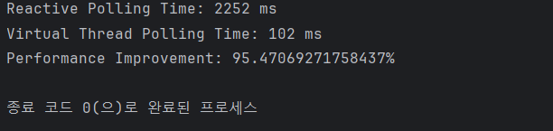

# 자바의 가상 스레드

**스레드의 종류(KLT vs ULT)**

크게 커널 수준 스레드와(Kernel-Level Threads) 사용자 수준 스레드(User-Level Threads)로 분리된다

- 커널 수준 스레드 : 스래드의 생성, 스케줄링 및 관리를 OS 커널이 담당, OS에 의존적이며. 자원 관리 및 멀티프로레싱 환경에서의 스케줄링 측면 장점이 있지만, 스레드 생성과 컨텍스트 스위칭에 높은 오버헤드가 있을 수 있다
- 사용자 수준 스레드 : 사용자 영역 라이브러리나 애플리케이션에 의해 관리되며 운영 체제 커널과는 독립적으로 스케줄링 된다. 스레드 관리 모든 작업을 사용자 영역에서 처리하며 스레드 생성 및 컨텍스트 스위칭이 빠르다. but 일부 리소스 공유 작업은 커널의 도움이 필요할 수 있으며, 자바 같은 경우 1:1 매핑이 되기에 이러한 이점이 줄어 들 수 있다

<br>

**스레드 풀** 

- ExecutorService 인터페이스를 통해 제공되며, JVM 힙 메모리에 여러 유저 레벨 스레드를 구현 및 생성하여 풀에 담아두고, 커널 레벨 스레드(KLT)를 JVM 이 유저 레벨 스레드(ULT)로 1:1로 매핑하여 사용
- Thread 객체는 JNI을 호출하여 커널 레벨 스레드에 1:1로 매핑하여 사용
- 스레드의 스케줄링은 JVM을 통해 운영 체제의 스레드 스케줄러에 위임(스케쥴 알고리즘)되어 관리
  - 이러한 스케줄러가 스레드 실행 타이밍과 프로세서 할당을 결정하지만, 실제 하드웨어의 CPU와 스레드는 무한정 할당 할 수 없다
    - 이로 인해 운영체제 스케줄러는 매우 빠르게 각 스레드를 돌아가며 실행

문제점 : 요량청이 급격히 증가하며, 서버에서는 더 많은 스레드를 요구하지만 작게 잡아 스레드 1개당 1MB의 사이드여도 최대, 4GB 메모리 환경에서는 4000 스레드까지만 만들 수 있으며 스레드가 많아지며 컨텍스트 스위칭 비용도 늘어남


기존의 스레드는 Platform Thread 였으며, 21부터는 새로운 유형의 Virtual Thread 가 추가 되었다

기존 Platform Thread 는 OS 스레드를 래핑해서 구현한 JVM 스레드다. 따라서 Platform Thread 수는 OS Thread 수에 제한되었었다

하지만 21 부터는 이러한 제한된 Thread 수를 해결할 경량 스레드를 목적으로 Virtual Thread 가 추가되었다, 더이상 OS Thread 수에 종속되지 않지만, OS Thread 에서 실행되며 여기서 I/O blocking 을 일으키면, Java runtime 은 해당 Virtual Thread 가 다시 실행될 때까지 중지한다. 

> 기존 Java의 스레드 모델은 Native Thread로, Java의 유저 스레드를 만들면 Java Native Interface(JNI)를 통해 커널 영역을 호출하여 OS가 커널 스레드를 생성하고 매핑하여 작업을 수행하는 형태

> 또 다른 방법으로 스레드를 공유하고 비동기 - 논 블로킹 방식을 사용해 처리량을 높이는 반응형 리액티브 기술도 있으나, 개발과 디버깅에 어려움이 있다는 단점이 있다


<br>

**Virtual Thread 특징**


Virtual Thread는 기존 Java의 스레드 모델과 달리, 플랫폼 스레드와 가상 스레드로 나뉜다. 플랫폼 스레드 위에서 여러 Virtual Thread 가 번갈아 가며 실행되는 형태로 동작

Virtual Thread 는 컨텍스트 스위칭 비용이 저렴하며, Stack 사이즈가 작다

하지만 기존 Platform Thread 보다 실행 속도가 빠른 스레드는 아니고 OS 스레드보다 동시에 더 많은 스레드 제공으로 높은 처리량 일뿐 절.대 더 빠른 실행 속도는 아니어서 Blocking(ex. I/O blocking) 되는 스레드에 적합하며, CPU intensive 작업에는 적합하지 않다


<br>

**Virtual Thread 내부**

Platform Thread 의 내부에 Virtual Thread 작업이 있게 되는데, Platform Thread 의 기본 스케줄러는 ForkJoinPool 을 사용해서 스케줄러는 platform thread pool 을 관리하고, Virtual Thread 의 작업 분배 역할을 한다

- Virtual Thread 는 carrierThread 를 가지고 있으며, 실제 작업을 수행하는 platform thread 를 의미한다. 또한 workQueue 를 가지고 있다
- scheduler 라는 ForkJoinPool을 가지고 있으며, carrier thread의 pool 역할을 하고, 가상 스레드의 작업 스케줄링을 담당한다
- 실제 작업내용 Runnable 을 가지고 있는 runContinuation 이 있다


    1. 실행될 virtual thread의 작업인 runContinuation을 carrier thread의 workQueue에 push
    2. Work queue에 있는 runContinuation들은 forkJoinPool에 의해 work stealing 방식으로 carrier thread에 의해 처리
    3. 처리되던 runContinuation들은 I/O, Sleep으로 인한 interrupt나 작업 완료 시, work queue에서 pop되어 park과정에 의해 다시 힙 메모리로 되돌아 감

  
  **Virtual Thread 스케줄링**

  Java platform thread는 OS가 스케줄링하지만, 가상 스레드는 Java runtime 이 스케줄링 한다. Java runtime은 가상 스레드를 platform thread에 할당하거나 mount 한 뒤 OS에게 스케줄링을 위임하여 일반적으로 Platform thread 를 스케줄링할 수 있게 한다
  
  가상 스레드 플랫폼 스레드 연결(할당)까지의 스케줄링은 Java runtime 의 몫이다(가상 스레드 실행 플랫폼을 carrier 라 한다)

  ex. 가상 스레드에서 I/O blocking 일어날 시, Java runtime 은 carrier 로부터 가상스레드 unmount 후, carrier 가 다른 가상 스레드 실행할 수 있게 함

  > 가상 스레드가 carrier 에 pinned(고정) 되면, blocking 에 진입해도 unmount 불가
  > 
  > 1. 가상 스레드가 synchronized 블록이나 메서드를 실행 중일 때
  > 2. 가상 스레드가 native 메서드나 foreign function 을 실행 중일 때


<br>

**가상 스레드 생성**

```java
void createVirtualThreadWithLambda() {
    Thread.startVirtualThread(() -> { // public static Thread startVirtualThread(Runnable task) {}
        System.out.println("Hello, Virtual Thread!");
        });
  }

void createVirtualThreadWithRunnable() {
  Runnable runnable = () -> log.info("Hello");

  Thread virtualThread = Thread.ofVirtual()
          .name("my-virtual1", 1)
          .unstarted(runnable);

  virtualThread.start();
}

/*
  Thread.Builder를 사용하여 가상 스레드를 생성하기
  - 가상 스레드는 기본적으로 데몬 스레드입니다.
  - 가상 스레드는 기본적으로 이름이 지정되어 있지 않지만, name으로 지정이 가능하며, name 다음인수로 넘버링 해요
*/
void virtualThreadDemo() throws InterruptedException {
  Thread virtualBuilder = Thread.ofVirtual().name("virtual-", 1);
  virtualBuilder.unstarted(() -> { 실행시킬내용 }); // Thread unstarted(Runnable task);
  virtualBuilder.start();
}

// ExecutorService를 사용하여 버추얼 스레드 생성하고 작업
void startVirtualThread() {
  ExecutorService executor = Executors.newVirtualThreadPerTaskExecutor();
  executor.submit(() -> {
    System.out.println("Task running in virtual thread");
  });
  executor.shutdown();
}
```


특정 스레드가 가상 스레드인지 확인

```java
boolean isVirtualThread = Thread.isVirtual();
```

해당 가상 스레드의 실행을 일시적으로 중단하고 다시 시작

    parK() : 현재 실행 중인 가상 스레드 일시 중지
    unpark() : park() 메서드에 의해 일시 중지된 가상 스레드 다시 시작

<br>

**속도 비교**

```java
public class ContextSwitchingComparison {
    public static void main(String[] args) {
        int numIterations = 1_000_000;
        long startTime, endTime;

        // Reactive 방식의 컨텍스트 스위칭 성능 측정
        startTime = System.currentTimeMillis();
        for (int i = 0; i < numIterations; i++) {
            ReactivePoller.poll();
        }
        endTime = System.currentTimeMillis();
        long reactiveTime = endTime - startTime;
        System.out.println("Reactive Polling Time: " + reactiveTime + " ms");

        // Virtual Thread를 사용한 방식의 컨텍스트 스위칭 성능 측정
        ExecutorService executor = Executors.newVirtualThreadPerTaskExecutor();
        startTime = System.currentTimeMillis();
        for (int i = 0; i < numIterations; i++) {
            VirtualThreadPoller.poll(executor);
        }
        endTime = System.currentTimeMillis();
        long virtualThreadTime = endTime - startTime;
        System.out.println("Virtual Thread Polling Time: " + virtualThreadTime + " ms");

        // 성능 비교
        double improvement = ((double) reactiveTime - virtualThreadTime) / reactiveTime * 100;
        System.out.println("Performance Improvement: " + improvement + "%");

        executor.shutdown();
    }
}

class ReactivePoller {
    public static void poll() {
        // 기존 Reactive 방식의 Net.poll() 코드
        // 이곳에는 컨텍스트 스위칭을 시뮬레이션하는 코드를 넣어주세요.
        // 예를 들어, sleep() 메서드를 호출하여 일정 시간동안 대기하는 방식으로 시뮬레이션할 수 있습니다.
        try {
            Thread.sleep(1); // 시뮬레이션을 위해 1ms 대기
        } catch (InterruptedException e) {
            e.printStackTrace();
        }
    }
}

class VirtualThreadPoller {
    public static void poll(ExecutorService executor) {
        // Virtual Thread를 사용한 Poller.poll() 코드
        // 이곳에는 가상 스레드를 사용하여 컨텍스트 스위칭을 시뮬레이션하는 코드를 넣어주세요.
        // 예를 들어, executor의 submit() 메서드를 사용하여 작업을 가상 스레드로 실행할 수 있습니다.
        executor.submit(() -> {
            try {
                Thread.sleep(1); // 시뮬레이션을 위해 1ms 대기
            } catch (InterruptedException e) {
                e.printStackTrace();
            }
        });
    }
}
```
컨택스트 스위칭 대신에 sleep() 를 통해서 컨텍스트 스위칭 유발


반면 CPU Bound 작업에서는 일반 스레드가 더 빠를 수 있다. 경량 스레인 Virtual Thread 도 결국 플랫폼 스레드 위에서 동작하기에, Switching 되지 않는 작업일 경우 Virtual Thread 생성 및 스케줄링 비용도 성능에 포함되기에 낭비가 발생할 수 있다
```java
public class ThreadPerformanceComparison {
    public static void main(String[] args) {
        int numIterations = 100;
        long startTime, endTime;

        // 가상 스레드에서 작업 실행하는 시간 측정
        ExecutorService virtualExecutor = Executors.newVirtualThreadPerTaskExecutor();
        startTime = System.currentTimeMillis();
        for (int i = 0; i < numIterations; i++) {
            virtualExecutor.submit(() -> {
                // 가상 스레드에서 실행될 작업
                doWork();
            });
        }
        virtualExecutor.shutdown();
        while (!virtualExecutor.isTerminated()) {}
        endTime = System.currentTimeMillis();
        long virtualTime = endTime - startTime;
        System.out.println("Virtual Thread Time: " + virtualTime + " ms");

        // 플랫폼 스레드에서 작업 실행하는 시간 측정
        ExecutorService platformExecutor = Executors.newFixedThreadPool(Runtime.getRuntime().availableProcessors());
        startTime = System.currentTimeMillis();
        for (int i = 0; i < numIterations; i++) {
            platformExecutor.submit(() -> {
                // 플랫폼 스레드에서 실행될 작업
                doWork();
            });
        }
        platformExecutor.shutdown();
        while (!platformExecutor.isTerminated()) {}
        endTime = System.currentTimeMillis();
        long platformTime = endTime - startTime;
        System.out.println("Platform Thread Time: " + platformTime + " ms");

        // 성능 비교
        if (virtualTime > platformTime) {
            System.out.println("Platform Thread is faster.");
        } else if (virtualTime < platformTime) {
            System.out.println("Virtual Thread is faster.");
        } else {
            System.out.println("Both have similar performance.");
        }
    }

    // 간단한 작업을 수행하는 메서드
    private static void doWork() {
        // 여기에 실제로 수행할 작업을 넣어주세요.
        // 이 예시에서는 단순히 루프를 돌며 시간을 소비하는 작업을 수행합니다.
        for (int i = 0; i < 100000; i++) {
            Math.random();
        }
    }
}
```


---

**참조**

- https://techblog.woowahan.com/15398/ 우아한 형제들 기술블로그 'Java의 미래, Virtual Thread'
- https://kghworks.tistory.com/174 JDK 21 Virtual Threads 돌아보기
- https://0soo.tistory.com/259 가상 스레드의 이해 종류, 사용법
- https://docs.oracle.com/en/java/javase/21/docs/api/java.base/java/lang/Thread.html 공식문서