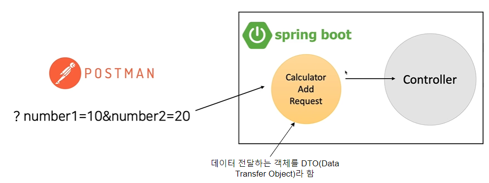

# 1일차. HTTP와 API란

- 어노테이션, 서버
- 네트워크
- HTTP와 API

---

자바를 시작하는데 앞서 `@SpringBootApplication`과 같은 것을 **어노테이션** 이라 한다

> **어노테이션(Annotation)**
>
> 다양한 일을 자동으로 할 수 있도록 해주는데 `@` 기호를 통해서 사용하여 표시되며 `@SpringBootApplication` 을 통해 모든 설정들이 자동으로 이루어 진다

<br>

**서버와 사용자의 관계**


<br>

**네트워크**

현실셰계와 같이 컴퓨터세계에서도 고유의 주소(IP)가 있다. 그 주소로 인터넷을 통해 데이터를 주고받게 된다. 데이터를 주고 받는데 있어서도 여러가지 메서드가 있는데 대표적으로 GET과 POST가 있다. GET은 서버로부터 데이터 조회를 요청해서 서버에 영향을 주지 않지만 POST는 다시 데이터를 담아 전송해서 서버에서 돌려줍니다


    프로토콜 :// 호스트 이름 : 포트 / 경로 및 파일 이름

**응답코드**

```
HTTP/1.1 200 OK
Content-Type: application/json

{
    "name":"A",
    "age":null
}
```


데이터를 주고 받으며 결과를 알려주는데 그 결과를 **응답 상태 코드**를 통해서 알 수 있다

    1xx (정보): 요청이 수신되었으며 서버가 프로세스를 계속하고 있습니다.
    2xx(성공): 요청이 성공적으로 수신, 이해, 수락 및 서비스되었습니다.
    3xx(리디렉션): 요청을 완료하려면 추가 조치를 취해야 합니다.
    4xx(클라이언트 오류): 요청에 잘못된 구문이 포함되어 있거나 이해할 수 없습니다.
    5xx(서버 오류): 서버가 명백히 유효한 요청을 이행하지 못했습니다.

이렇게 HTTP를 통해 데이터를 주고받으며 동작할때 정해진 규칙을 `API`라 한다



---

### 질문

**1. 어노테이션을 사용하는 이유(효과)는 무엇일까?**

프로그램의 규모가 커짐에 따라 적어야 하는 설정이 많아져서 이를 해결하기 위해 런타임이나 컴파일시 해석되어지는 **어노테이션**을 사용하게 되었다.

문서화, 컴파일러 체크, 코드 분석등 다양한 이유로 사용되어 지지만 본질적인 목적으로는 `메타데이터`를 표현할 수 있다

> 메타데이터란 정보에 대한 정보 표시로서 `@Override`와 같은것을 사용하게 되면 이 다음 오는 함수는 오버라이딩 해야 한다와 같이 정보를 알려주며 표시한다

<br>

**2. 나만의 어노테이션은 어떻게 만들 수 있을까?**

**만들기전 사전지식**

Java의 어노테이션에는 built-in 어노테이션과 Meta어노테이션이 존재한다
- built-in 어노테이션
    - Java 코드에 적용되는 어노테이션
    - @Overrie, @Deprecated, @SuppressWarnings 등이 존재

- meta 어노테이션
    - 다른 어노테이션에 적용되기 위한 어노테이션
    - @Retention, @Documneted, @Target, @Inherited, @Repeatable 등이 존재

Meta 어노테이션 종류

    Retention: 해당 어노테이션의 정보를 어느 범위까지 유지할 것인지를 설정함
    - RetentionPolicy.SOURCE: 컴파일 전까지만 유효하며 컴파일 이후에는 사라짐
    - RetentionPolicy.CLASS: 컴파일러가 클래스를 참조할 때까지 유효함
    - RetentionPolicy.RUNTIME: Reflection을 사용하여 컴파일 이후에도 JVM에 의해 계속 참조가 가능함

    Documented: JavaDoc 생성 시 Document에 포함되도록 함

    Target: 해당 어노테이션이 사용되는 위치를 결정함
    - ElementType.PACKAGE : 패키지 선언시
    - ElementType.TYPE : 타입 선언시
    - ElementType.CONSTRUCTOR : 생성자 선언시
    - ElementType.FIELD : 맴버 변수 선언시
    - ElementType.METHOD : 메소드 선언시
    - ElementType.ANNOTATION_TYPE : 어노테이션 타입 선언시
    - ElementType.LOCAL_VARIABLE : 지역 변수 선언시
    - ElementType.TYPE_PARAMETER : 매개 변수 타입 선언시
     
    Inherited: 해당 어노테이션을 하위 클래스에 적용함
    Repeatable: Java8부터 지원하며, 연속적으로 어노테이션을 선언하는 것을 허용함

<br>

1. 인터페이스 앞에 @를 붙여서 생성
    ```
    public @interface RestControllerWithSwagger {
        // 
    }
    ```
   생성은 되어서 다른 곳에서 참조되지만 아무런 기능을 하지 못한다


2. 메타 어노테이션 추가
    ```
   @Retention(RetentionPolicy.RUNTIME)
   // 어느 범위까지 유지할 것인가
   // 컴파일 이후에도 JVM에 의해 계속 참조가 가능하도록
   
   @Inherited  
   // 해당 어노테이션을 하위 클래스에 적용
   
   @Documented
   // JavaDoc 생성 시 Document에 포함되도록
    
   @Target(ElementType.TYPE)   
   // 해당 어노테이션이 사용되는 위치
   
   public @interface RestControllerWithSwagger {
   
   }
    ```

3. 적용할 어노테이션 추가로 있을시 추가
   ```
   @Api
   @RestController
   @Retention(RetentionPolicy.RUNTIME)
   // 어느 범위까지 유지할 것인가
   // 컴파일 이후에도 JVM에 의해 계속 참조가 가능하도록
   
   @Inherited  
   // 해당 어노테이션을 하위 클래스에 적용
   
   @Documented
   // JavaDoc 생성 시 Document에 포함되도록
    
   @Target(ElementType.TYPE)   
   // 해당 어노테이션이 사용되는 위치
   
   public @interface RestControllerWithSwagger {
   
   }
    ```

   @Api와 @RestController에도 적용되도록 추가해줌

4. 변수 추가

   ```
   @Api
   @RestController
   @Retention(RetentionPolicy.RUNTIME)
   // 어느 범위까지 유지할 것인가
   // 컴파일 이후에도 JVM에 의해 계속 참조가 가능하도록
   
   @Inherited  
   // 해당 어노테이션을 하위 클래스에 적용
   
   @Documented
   // JavaDoc 생성 시 Document에 포함되도록
    
   @Target(ElementType.TYPE)
   // 해당 어노테이션이 사용되는 위치
   
   public @interface RestControllerWithSwagger {
    String name() default "RestController";
    String value();
   }
   ```
   어노테이션에 값 부여를 위해 변수 선언


5. 적용
   ```
   @RestControllerWithSwagger(value = "RestMemberController", name = "RestMemberController")
   @RequiredArgsConstructor
   @Test1
   @RequestMapping("/member")
   public class RestMemberController {
   
   private final MemberService memberService;

   @ApiOperation("멤버 목록 반환")
   @GetMapping("/list")
   public ResponseEntity<String> upload() {
     return ResponseEntity.ok(memberService.getList());
    }
   }
   ```
---

### 출처

- https://www3.ntu.edu.sg/home/ehchua/programming/webprogramming/HTTP_Basics.html HTTP
- https://kkminseok.github.io/posts/2023-01-26-Annotation_Ad01/ 어노테이션 참조
- https://mangkyu.tistory.com/130 망나니 개발자님 어노테이션 만들기