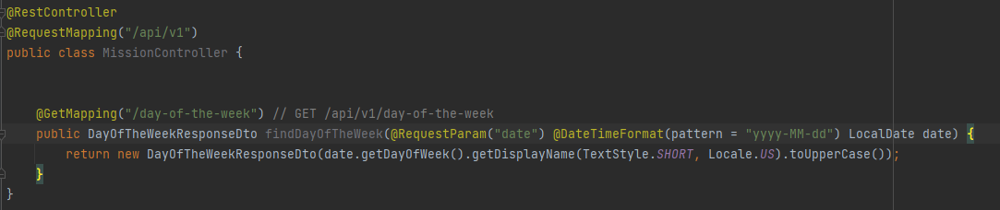

# 2일차. POST API와 유저 API

- POST API 개발하고 테스트하기
- 유저 생성 API개발
- 유저 조회 API 개발과 테스트

---

GET에서는 쿼리를 통해서 데이터를 받았지만 POST에서는 Body를 통해서 값을 받게 된다

이때 사용되는 문법을 **JSON(JavaScript Object Notation)** 이라 한다

    {
        "key":"value", 형태로 표시
        "dogs" : ["코코", "방울이"]
    }


GET이어도 Controller에서 getter가 있는 객체를 반환하게 되면 JSON형태로 반환할 수 있다

```
public class Fruit {

    private String name;
    private int price;

    public Fruit(String name, int price) {
        this.name = name;
        this.price = price;
    }

    public String getName() {
        return name;
    }

    public int getPrice() {
        return price;
    }
}
 ```
-> GET으로 확인하면 getter의 항목대로 뽑히게 된다

      {
         "name": "바나나",
         "price": 2000
      }

<br>

> 지금까지의 문제점 : 서버를 껏다가 켜면 남아있는 데이터가 없다. 유저 정보는 메모리에만 유지되고 있다

---

### 문제

1. 두 수를 입력하면, 다음과 같은 결과가 나오는 `GET` API 만들기


    path : /api/v1/calc
    쿼리 파라미터 : num1, num2

    {
        "add": 덧셈결과,
        "minus" : 뺄셈결과,
        "multiply": 곱셈결과
    }


<br>

2. 날짜를 입력하면, 몇 요일인지 알려주는 `GET` API를 만들기(path와 쿼리 파라미터는 임의로 만들어도 상관없음)


    ex) GET /api/v1/day-of-the-week?date=2023-01-01

    {  
        "dayOfTheWeek" : "MON"
    }


실패했다

에러 코드를 봤을때 400과 Bad Request인것을 보아 클라이언트의 URL이 잘못되었거나 서버에서 이 요청을 받지 못하는 상황이라 판단했다

하지만 눈씻고 찾아봐도 GET url상 잘못된것은 없어서 서버에서 GET요청을 못받는 것이라 생각이 들었다

결론부터 말하자면 오류를 찾아서 해결했다


문제는 GETMapping을 받을때 LocalData 타입으로 직접 파라미터 받는것이 내가 사용하는 스프링 '2.7.6'에서는 지원이 되어지지 않았다. 3.2 버전부터는 바로 받을수 있었는데 현재 버전에서는 쿼리 매개변수에서 문자열 형태로 자동 객체 변환을 지원하지 않아 String이나 `@DataTimeFormat`을 통해서 문자열을 변환해 주어야 했다



<br>

3. 여러 수를 받아 총 합을 반환하는 `POST` API를 만들기

   (API에서 받는 Body는 다음과 같은 형태, 요청받는 DTO에서 `List`를 갖고 있으면 JSON의 배열을 받을 수 있음)


    {
        "numbers" : [1, 2, 3, 4, 5]
    }

POST형식으로 List<Integer> 형식의 리스트에 값을 받도록하고 for문을 통해 합을 받으려 했는데 또 실패했다(ㅠㅠ)


에러 코드를 보니 서버 쪽에서 무언가 문제가 있다 판단했지만, 결국 원인을 못찾았다. 함꼐 진행하는 디스코드 방에서 힌트와 이유를 알수 있었는데 `InvalidDefinitionException` 예외가 발생 한다는 것을 알았다.

예외 메시지를 살펴 봤을때 해당 객체를 대상으로 기본 생성자가 없어 예외가 난다는데 Jackson 라이브러리에서 발생한 `InvalidDefinitionException` 예외로 jackson라이브러리가 JSON 내부에 객체 형태로 넘어온 값을 실제 객체로 변환하기 위해 **역직렬화**과정을 거치는데, 이 과정중 기본 생성자가 없으면 역직렬화를 실패해 예외가 발생한다 -> 이에 따라 기본 생성자를 만들어 주면 된다는 것을 배울수 있었다

> 객체를 JSON으로 변환하거나 JSON을 객체로 변환 할때에는 관련 클래스에 기본 생성자가 필요하다
>
> 또한  @JsonProperty 어노테이션을 사용하여 DTO의 매개변수가 있는 생성자에 JSON 프로퍼티를 명시적으로 매핑함으로써, 기본 생성자 없이도 JSON 데이터를 해당 객체로 역직렬화할 수 있다

<br>


      Jackson이 객체를 역직렬화할 때 사용할 수 있는 "속성 기반 생성자"를 제공하기 위해, 
      생성자 파라미터에 @JsonProperty 어노테이션을 사용할 수 있다. 
      이 방법은 Jackson에게 JSON 데이터의 어떤 필드가 클래스 생성자의 어떤 파라미터와 매핑되는지
      명확하게 지시할 수 있다


---

### 출처

- https://www.inflearn.com/blogs/6595 과제 도움받음
- https://twojun-space.tistory.com/180 과제 도움받음