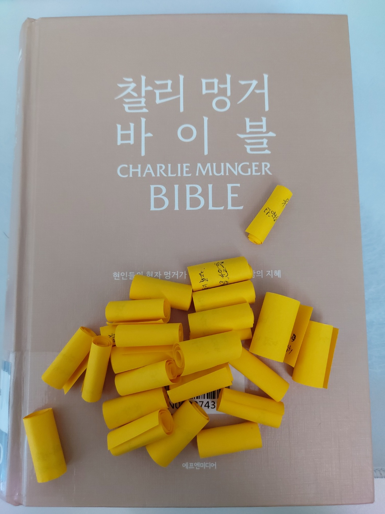

# 찰리멍거 바이블 "세상을 살아가는 지혜"

어느 한 분의 추천으로 책을 접하게 되었는데, 경제적인 것뿐만 아니라 '내가 하는 업을 잘 하려면 내 업에 대한 이해만 있어선 안되고, 다른 업에 대한 지식이 추가될때 진정으로 실현 될 수 있다' 이러한 내용이 있다는 말과 함께 강력 추천하셔서 홀린듯이 도서관에서 빌려 읽게되었다

내용이 길어서 부분 부분 감명깊고 마음에 남는 내용을 포스트잇을 붙여가며 읽었다가 그 내용을 발췌하여 기록을 남긴다

 버핏의 친구였자 동료였던 멍거는 버핏과 달리 따로 책을 내거나 자신의 의견을 담은 무언갈 남기지 않아서 그의 의견과 가치관은 쉽게 접하기 어렵다, 그럼에도 그의 가치관을 엿볼수 있는 강연내용들을 엮어서 냈으며 그가 직접 관여한 책이다. 책을 읽기에 앞서 그의 가치관을 엿볼수 있는 한마디 말을 보며 읽기를 시작한다면 그의 가치관을 더 잘 파악할 수 있지 않을까 한다

> "문제를 뒤집어 생각할 때 잘 풀리는 경우가 많다"   "행복해질 수 있는 방법을 찾는 대신 확실히 불행해 지는 길은 피해라"

 

### 가격이 잘못 매겨진 베팅의 기회

- 오판의 심리학

`"인간의 심리를 공부하고 탐구하는게 투자에 있어 우위를 주는가? 아니, 인간의 의사결정은 전혀 합리적이지 않다"` 

다른 투자자의 실수와 내 사고방식의 실수 가운데에서 수익을 얻어야 한다. 가운데에서 자신의 부족함을 알고 더 배우고 노력해야 한다. 학습하고 또 학습하자

- 머릿속에 격자 모형이 있어야 한다

삶을 살아가며 겪는 경험들을 내 머릿속에 잘 끼워놔야 하는데 하나의 모형만 있어서는 안되고 다양한 경험을 하면서 여러개가 있어야 한다. "망치를 든 사람에게는 모든 문제가 못으로 보인다" 는 말과 같이 하나의 경험만으로는 형편없는 사고방식을 가질 수 밖에 없다.

그 가운데에서 큰 비중을 차지하는 모형들이 있는데 기본수학, 확률, 회계, 심리학을 반드시 알아야 한다. 간단히 설명하자면

    수학 : 숫자와 수량을 알고 확률의 기초다
    확률 : 사람들은 무의식적으로 확률을 계산한다
    회계 : 상권에 대한 이해, 근사치측정
    심리학 : 소통에서 사용하는 육하원식 why?, 항상 이유를 명시해야 더 잘 이해하고 더 잘 따른다

- 기술 발전에 따른 이득

발전에 따라 효율적인 제작이 가능해져 이익이 생겼다. 그런데 비용이 절감 된다면 회사에 남는 몫과 고객에게 가는 몫은 얼마인가? 절감에 따라 무작정 사업을 확장해서는 발전을 안하니만 못하게 된다

### 다양한 인식 모형으로 비즈니스 분석하기

- 투자 성공을 이끄는 것은 '기질'과 끊임없는 '학습'

끈기 있게 기다리고 때가 오면 공격적이기 또한 힘든 교훈 일수록 직접 겪어서 배우기 보다는 대리 경험을 통해서 배우자, 돌이킬 수 없는 손실은 너무나도 뼈아픈 리스크다.

지속석 학습을 통해 능력범위를 확대하고 무엇에나 호기심을 가지고 독서를 통해 경험을 배우고 아이디어를 고수하며 **실행**까지 옮기는 기질이 있어야 한다. 대부분 아이디어를 고수하지 못하거나, 고수해도 실행에 옮기지 못한다

> 기업과 비즈니스를 잘 알기 위해서는 세상의 이치를 전문가만큼 잘 알아야 하며, 끊임없는 학습과 배움을 즐겨야 한다

- 기업 운영의 더 큰 생태계

법률가 마르쿠스 툴리우스 키케로 왈 "자신이 태어나기 전에 발생한 일을 모르는 사람은 인생을 어린아이처럼 살게 된다" 찰리 멍거는 여기에 더해 다른 모든 학문의 핵심 개념도 알고 머릿속 격자틀 인식 모형에 각인될 정도로 알아야 한다고 강조했다. 

    격자틀 인식 모형속[머리속 개념 정립]

    기업 분석 -> 기업의 재무 정보, 내부 경영뿐만 아니라 기업 운영의 생태계를 분석해야 한다

- 대학 교육에 대한 멍거의 평가

교수 같은 경우 한분야의 전문가로 다양한 접근 방식을 제시하지는 못한다. 자신의 모형을 과하게 사용하며 타 학문의 중요성을 잘 이용하지 못한다는 의견이다 (나도 매우 동의 한다)

- 독립적 사고

아무 생각 없이 시장에 휘둘려서는 부자가 될 수 없다. 전문가의 예측을 함부러 믿어서는 안된다. 만약 이발사에게 이발할 때가 되었는지 물어보면 되겠는가?

전문가를 고용한다고 어떠한 문제가 해결될 거란 믿음은 매우 위험하다. 예를 들어 한 건물주는 건물을 짓고 나서 세가지를 두려워 한다. 건축가, 도급업자, 언덕 (잠재적 문제를 걱정)

    독립적 사고가 필요한 이유
    1. 기존 규범이나 계층 구조에 얽매이지 않으며 창의적인 아이디어와 혁신적인 솔루션 창출을 위해
    2. 상황에 대한 접근 방식과 적응력이 유연해지고 새로운 상황 정보에 대한 대응과 관점을 신속하게 조정할 수 있다
    3. 가정에 대한 의문을 제기하며, 다양한 관점, 신중한 평가를 통해 비판적 사고와 분석이 가능하다
    4. 주인의식을 가지며 목표 달성에 대한 책임감을 느낄수 있다

- 변호사의 필요로 하는 사람은 누구인가?

정직한 사람과 교활한 사람, 누구를 도와줘야 하겠는가? 조금만 생각하면 알 수 있듯이 정직하고 청렴한 사람은 일을 잘 처리할 것이고 큰 사건이 일어나지 않지만 거짓되고 교활한 사람은 매우 큰 문제가 틈만나면 생기게 될 것이다

이와 같이 나는 정직하고 모범 시민일지라도 내가 상대해야 하는 사람은 나와 결이 다를 수가 있다

    누구를 고객으로 상대하는가?
    
    변호사가 상대하는 사람 -> 문제가 있는 사람
    의사가 상대하는 사람 -> 병이든 사람
    경찰이 상대하는 사람 -> 논란의, 죄의 의심을 받는 사람

    삶을 살아가는데 있어서 문제의 소지가 있는 사람에게도 서비스를 제공해야 할 수도 있다는 사실과,
    그러한 소지의 사람과 얽히지 않기 위해서는 어떠한 삶을 살아야 하는가를 엿볼수 있다

이러한 사실을 어린아이에게 가르친다면 열마디 말보다 실제 직업의 사례를 들어주며 알려준다면, 어린아이가 스스로 생각하며 더 깊이 있게 교훈을 받아들일수 있을것

- 효울적 시작 이론을 무시하는 자들

대대로 전통적으로 지켜져오는 관습중에 좀더 실용적으로 바꾸자는 의견이 있을때 그 의견을 쳐다보지도 않고 묵살하는 경우들이 우리의 주위에서도 찾아볼 수 있다.
"익숙해서", "들어봤지만 주의깊게 듣지 않아서" 와 같이 사람들은 자신의 의견을 잘 바꾸지 않는다

이를 두고 벤저민 프랭클린은 한마디 했었다 "누군가를 설득하려면 이성이 아닌 이기심에 호소해야 한다"

이 말에 매우 동의하며 개인적인 경험으로 토론이나 설득하는 모습을 봤을때도 사람은 매우 이성적이고 눈에 보이는 숫자들과 통계, 확률을 믿는것 같아도 실제 마음이 움직이는데는 감정적인 호소와 외침에 마음이 움직인다고 필자는 생각한다

주식시장도 이와같다. 매우 이성적으로 완벽하게 효율적으로 움직이는것 같아도 전혀 그렇지 않다 (국내 주식에서 성공하기 위해서는 야수가 되어야한다고 말한다. 필자는 이에 덧붙여 야수로는 부족하다 생각하며 야수가 아닌 짐승 비스무리한게 되어야 한다고 본다)

### 오판의 심리학

- 확증 편향

사람은 자신의 생각에 반대되는 생각이나 의견을 쉽게 기억에서 잊어버리고 주의깊게 보지 못하는 경향이 있다고 본다. 이러한 사실을 인정하고 극복하기 위해서는 나의 의견에 언제나 반대의견을 내줄수 있는 파트너를 곁에 두는것, 언제나 반대 의견을 외면하지 않고 사실과 분석에 근거한 판단을 내리는 것이다

- 일관성, 몰입 편향

남이 소리 높여 주장하는 견해는 우리에게 큰 영향을 미치지 못한다. 하지만 우리 자신이 어떠한 견해를 공표하면 그 견해는 우리 뇌리에 새겨진다. 하지만 이러한 방식은 유연한 사고를 막게 된다

    어느 한 실험에서 죄수와 교도관 집단으로 나누고 연기를 시켰는데 얼마못가 중단이 되었다.
    정신적으로 실험자들이 정신적으로 피폐해지고 힘들어하는 상황이 벌어졌다.
    역할일 뿐이었는데 이러한 일이 발생한 이유는 역할 실행 과정중 자신의 생각까지 지배당하고 말았다

이를 통해 우리의 생각이 행동을 바꾸고 영향을 줄수 있다는 것을 알 수 있는데, 진짜 중요한 것은 행동이 생각을 바뀌는 것이다

### Q&A. 멍거주의 

- Q. 오늘 인생을 다시 시작한다면 무엇을 바꾸고 싶은가?

가장 현명한 인물로 불리는 벤저민 프랭클린도 많은 실수를 저질렀다. 나는 내 인생을 바꾸고 싶지 않다.

웬만큼 성공한 사람은 대부분 충분히 행복하다. 더 부유하다고 행복한것도, 더 가난하다고 불행해지는 것도 아니다

> 독일 속담 "사람은 너무 빨리 늙고 너무 늦게 철든다"

- Q. 행복한 인생을 사는 데 필요한 원칙은?

1. 기대 수준이 너무 비현실적으로 높으면 평생 비참하게 살 수 밖에 없다. 기대 수준을 낮춰야 한다. 나는 기대 수준을 잘 낮춰서 유리했다. 그렇지 못하다면 극기심을 발휘하며 결과가 좋든 나쁘든 담담하게 받아들여라
2. 간혹 일이 잘 풀리지 않는다면 뒤집어 생각하는 방식이 유용하다
3. 세상에는 좋은 사람이 부족하지 않을만큼 많다, 좋은 사람을 최대한 많이 찾아내서 함께 살아가기만 하면 된다

> "항상 진실을 말하고, 누구에게도 절대 거짓말하지 말라"   필자 개인적으로 좋아하는 말이며 인생의 가치관중 하나다

- 유용한 개념과 태도

원하는 것을 확실하게 얻으려면 노력해서 그만한 자격을 갖추어야 한다. 남이 '나'에게 제공하기를 바라는 것이 있다면 '나'도 그만큼 남에게 제공해야 한다는 개념이다(역지사지)

불평등 극대화 : 농구 시합에서 보면 가장 상위 선수만 경기를 뛴다. 수술에 있어서도 가장 실력있는 의사가 가장 많은 수술을 한다. 가장 뛰어난 효과를 위해서 가장 재능과 의지가 뛰어난 사람의 경험을 더욱이 극대화 시킨다. 

이 사실의 뒷편에는 우리는 모두에게 평등한 기회를 부르짖지만서도 우리는 가장 뛰어난 사람에게 가장 많은 활약을 하길 바란다

근면 : 끈질기게 노력하며 남보다 뒤쳐지면 따라잡을 때까지 일하며 노력했다는 것이다. 단순한 전통적인 개념이지만 반드시 좋은 성과를 얻게 된다

역경 : 살다 보면 부당하게 끔찍한 역경을 만날수도 있는데, 극복하는 사람도 극복하지 못하는 사람도 있다. 모든 불운을 유용한 교훈으로 삼고 역경이 닥쳤을때 자기 연민에 빠지지 말고 건설적으로 활용해야 한다

> 역경에는 동의하지 못하겠다. 힘들어도 봤고 자기 연민에 빠진 와중에서 그것을 활용하려 한다는건, 여유가 있다는 것으로만 들린다
> 
> 역경이 닥친다면 피할수 없을태니 받아들이고 물흐르듯 천천히 받아들일수 있어야 한다고 생각한다(사실 아직 잘 모르겠다)

---

**후기**

도움되는 내용도 많았고 삶의 가치관 형성에 있어서 맞는 부분이 많아 재밌게 읽을 수 있었다. 경제에 국한된 것이 아닌 다방면의 지식을 필요로 하며 자신의 생각에 메몰되어서는 안된다는 것이 내 평소생각을 대변해주는 것 같아서 기분이 좋았다

하나씩 포스트잇을 끼우며 읽고 다시 회수하며 글을 처음 써 봤는데 밭에 뿌린씨를 하나씩 추수하듯 회수하는 재미가 있고 그냥 회고를 쓰는 것보다 쓰는 재미가 있어서 즐거웠다. 자주 사용하며 읽게 될 것 같다.
